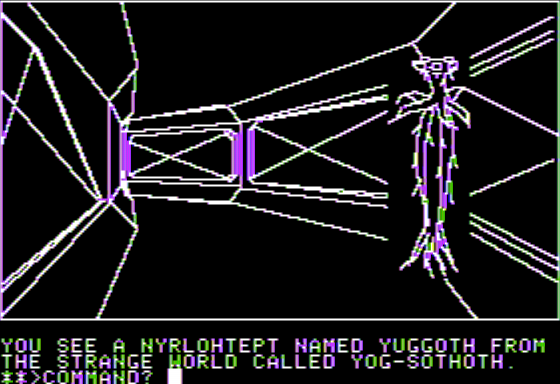

# Queen of Phobos   ![Badge Publisher]

*Source code provided by **[Paul Berker]**.*

 

 
 

[![Button Interview]][Interview]

 
 

 
 

## Platforms

<kbd>  Apple II  </kbd>

 
 

## Files

*The file archives provided.*

 

### Modem Text Version

[![Button Source]][Source Modem]   
[![Button Disk]][Disk Modem]

 

### Phobos Dav Holle IO Phobio

[![Button Source]][Source Phobio]   
[![Button Disk]][Disk Phobio]

 

<!----------------------------------------------------------------------------->

[Paul Berker]: https://slasherworld.com/

[Interview]: https://archive.org/details/paul-berker-phoenix-software

[Source Phobio]: Source/Phobos%20Dav%20Holle%20IO%20Phobio
[Source Modem]: Source/Queen%20of%20Phobos%20Modem%20Text%20Version

[Disk Phobio]: Source/Phobos%20Dav%20Holle%20IO%20Phobio.DSK
[Disk Modem]: Source/Queen%20of%20Phobos%20Modem%20Text%20Version.SDK

<!----------------------------------[ Badges ]--------------------------------->

[Badge Publisher]: https://img.shields.io/badge/Publisher-Phoenix_Software-bb603d?style=for-the-badge&labelColor=EF7B4D

<!---------------------------------[ Buttons ]--------------------------------->

[Button Interview]: https://img.shields.io/badge/Interview-49B48A?style=for-the-badge&logoColor=white&logo=InternetArchive
[Button Source]: https://img.shields.io/badge/Source-0091BD?style=for-the-badge&logoColor=white&logo=CodeFactor
[Button Disk]: https://img.shields.io/badge/Disk-50162D?style=for-the-badge&logoColor=white&logo=Discogs

